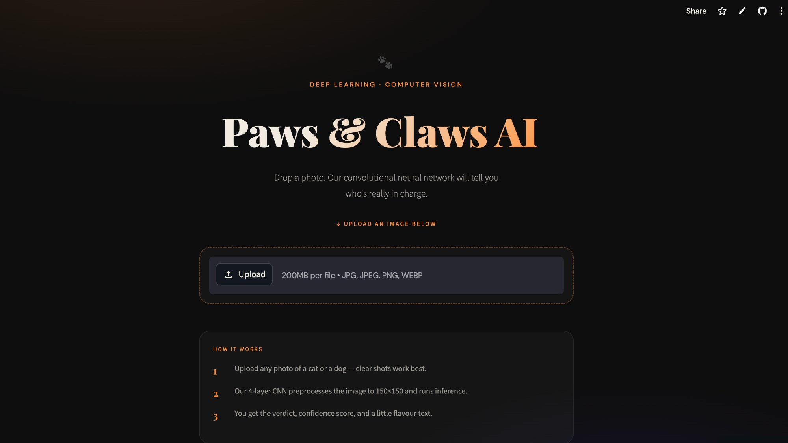
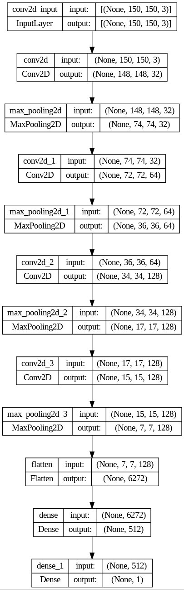

# 🐾 Paws & Claws AI — Cats vs Dogs Classifier

A deep learning web app that classifies images as **cats or dogs** using a Convolutional Neural Network (CNN) built with TensorFlow/Keras, served via a sleek Streamlit interface.

---

## ✨ Live Demo

🔗 **[pawsandclaws.streamlit.app](https://pawsandclaws.streamlit.app/)**

---

## 📸 App Preview



---

## 🧠 Model Architecture

Built from scratch using a 4-block CNN trained on the Kaggle Dogs vs Cats dataset.



| Layer | Output Shape |
|---|---|
| Input | (None, 150, 150, 3) |
| Conv2D + MaxPooling | (None, 74, 74, 32) |
| Conv2D + MaxPooling | (None, 36, 36, 64) |
| Conv2D + MaxPooling | (None, 17, 17, 128) |
| Conv2D + MaxPooling | (None, 7, 7, 128) |
| Flatten | (None, 6272) |
| Dense(512) | (None, 512) |
| Dense(1, sigmoid) | (None, 1) |

- **Loss:** Binary Crossentropy  
- **Optimizer:** Adam  
- **Output:** 0 = Cat, 1 = Dog  
- **Dataset:** [Kaggle Dogs vs Cats](https://www.kaggle.com/datasets/salader/dogsvscats)

---

## 🗂 Project Structure

```
CNN/
├── assets/
│   ├── app_screenshot.png
│   └── architecture.png
├── models/
│   └── cats_vs_dogs_model.keras
├── app.py
├── Cats_vs_Dogs.ipynb
├── requirements.txt
├── .gitignore
└── README.md
```

---

## 🚀 Run Locally

### 1. Clone the repo
```bash
git clone https://github.com/habeebasid/paws_claws_ai.git
cd paws_claws_ai
```

### 2. Create and activate a virtual environment
```bash
python3 -m venv ds-env
source ds-env/bin/activate
```

### 3. Install dependencies
```bash
pip install -r requirements.txt
```

### 4. Launch the app
```bash
streamlit run app.py
```

---

## 📦 Tech Stack

| Tool | Purpose |
|------|---------|
| TensorFlow / Keras | Model training & inference |
| Streamlit | Web app interface |
| Pillow | Image preprocessing |
| scikit-learn | Evaluation metrics |
| OpenCV | Image utilities |

---

## 📊 Training Details

| Parameter | Value |
|-----------|-------|
| Image size | 150 × 150 |
| Batch size | 20 |
| Validation split | 20% |
| Activation (output) | Sigmoid |
| Dataset | Dogs vs Cats (Kaggle) |

---

## 🙋‍♀️ Author

**Habiba**  
Built as a hands-on CNN project — trained on MacBook, deployed on Streamlit Cloud.

---

## 📄 License

MIT — feel free to fork, modify, and build on it.
